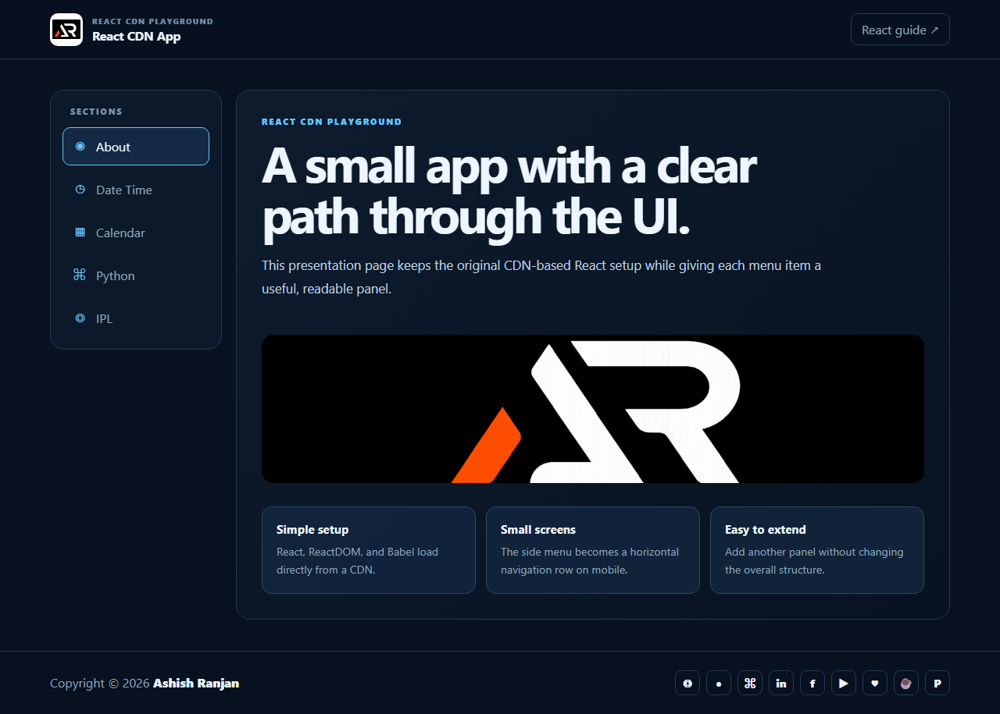

# React CDN App

A small React 18 playground that loads React, ReactDOM, and Babel from CDN scripts and presents a few focused frontend panels.

## Features

- React CDN setup with no build tooling.
- About, Date Time, Calendar, Python, and IPL panels.
- Responsive section navigation with an active state.
- Local branding assets, fixed header, and floating go-to-top button.
- Icon-only social and support links in the footer.

## Tech stack

React 18, ReactDOM, Babel Standalone, HTML, and CSS.

## Run locally

Open `index.html` in a browser or serve the folder with any static web server.

## Live

[Open the live project](https://a2rp.github.io/react_cdnapp/)

## Links

- Portfolio: [https://www.ashishranjan.net](https://www.ashishranjan.net)
- GitHub: [https://github.com/a2rp](https://github.com/a2rp)
- CodePen: [https://codepen.io/ash1198](https://codepen.io/ash1198)
- LinkedIn: [https://www.linkedin.com/in/aashishranjan](https://www.linkedin.com/in/aashishranjan)
- Facebook: [https://www.facebook.com/theash.ashish/](https://www.facebook.com/theash.ashish/)
- YouTube: [https://www.youtube.com/@ashishranjan-ashz?sub_confirmation=1](https://www.youtube.com/@ashishranjan-ashz?sub_confirmation=1)
- Email: [ash.ranjan09@gmail.com](mailto:ash.ranjan09@gmail.com)

## Support

- Support: [https://a2rp-donation-page.netlify.app/](https://a2rp-donation-page.netlify.app/)
- Buy Me a Coffee: [https://buymeacoffee.com/a2rp](https://buymeacoffee.com/a2rp)
- Patreon: [https://patreon.com/a2rp](https://patreon.com/a2rp)
